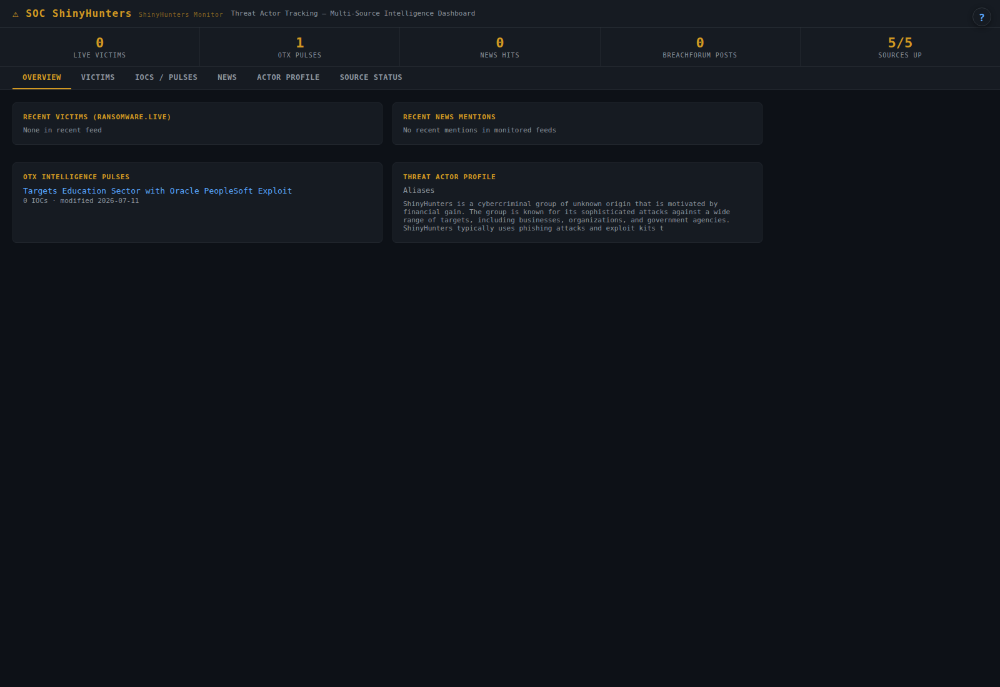

# soc-shinyhunters — ShinyHunters threat actor tracker

> One timeline for everything the ShinyHunters data-extortion crew does — leak-site victims, OTX pulses, MISP Galaxy entries and news, in a single dashboard

  

ShinyHunters is a data-theft and extortion group behind a long run of large-scale
breaches. Intelligence about them is scattered across leak sites, OTX pulses, MISP Galaxy
metadata and press coverage. `soc-shinyhunters` pulls those sources into one searchable,
chronological actor view, so you can answer "what have they done lately, and does it touch us?"
without opening six tabs.

Part of a self-hosted SOC fleet: a small, dependency-light Python service with a web
dashboard, a JSON API and a built-in manual. No agents, no cloud, no telemetry.

## Features

- **Consolidated activity feed** from several sources, deduplicated and time-ordered
- **OTX pulse enrichment** — indicators published against the actor
- **MISP Galaxy** actor metadata (aliases, known TTPs)
- **News/RSS** coverage alongside the technical intel
- **Searchable event list** for fast lookup

## Quick start

    cp .env.example .env
    env $(cat .env | grep -v '^#' | xargs) python3 app.py
    # → http://localhost:8097

Python 3.8+. Standard library only — nothing to `pip install`.

## Configuration

| Variable | Purpose |
|----------|---------|
| `OTX_API_KEY` | AlienVault OTX key — enables pulse enrichment (optional) |
| `PORT` | Listen port (default `8097`) |

## HTTP endpoints

| Path | Purpose |
|------|---------|
| `/` | Dashboard (HTML) |
| `/api/data` | Aggregated actor feed (JSON) |
| `/manual` | Built-in user manual |

## How it fits

Actor-focused companion to the fleet-wide **soc-ransomware** tracker; indicators can be pushed to **soc-intel** for STIX 2.1 storage.

## Documentation

**[MANUAL.md](MANUAL.md)** — full user guide (also served at `/manual`, via the **?** button in the UI).

## Keywords

ShinyHunters · threat actor tracking · data extortion · breach intelligence · OTX · MISP Galaxy · CTI · dark web monitoring · threat hunting · self-hosted

## License

MIT — see [LICENSE](LICENSE).
